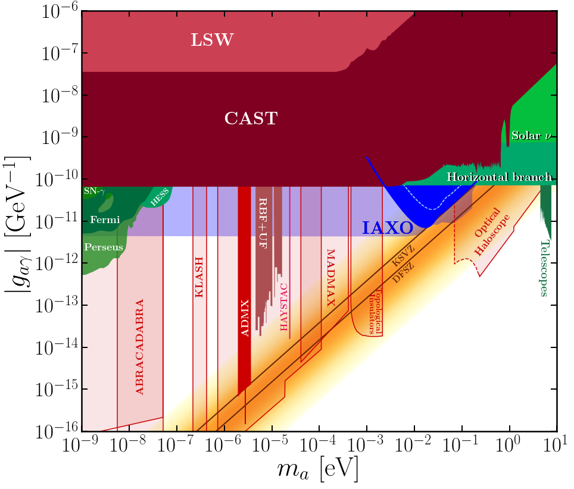
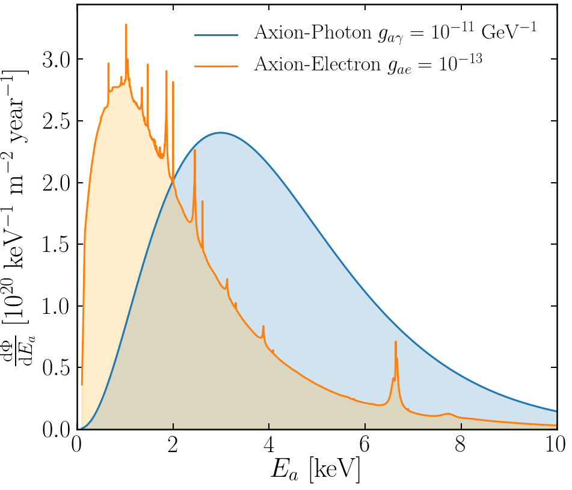

# IAXOmass
Code for reproducing results from [arXiv:[1811.?????]](https://arxiv.org/abs/1807.09004)  "**Weighing the Solar Axion**" on how IAXO can use the energy dependence of the X-ray spectrum from Solar axion conversion to measure the axion mass over a small range when the discrimination is not destroyed by oscillations.

The code is written in python, and all the plots are generated using jupyter notebooks. This repository contains all the code needed to reproduce the paper. Only major python requirement is the [`iminuit`](https://iminuit.readthedocs.io/en/latest/) package, although currently that bit of the code is unused in any of these results, but will be needed for future studies with more complicated likelihood functions to minimize. 

Email me at ciaran.aj.ohare@gmail.com if you think anything is not as it should be or if you have questions.

---

## Fig. 1

[Click here for the notebook](https://github.com/cajohare/IAXOmass/blob/master/code/plot_FinalLimit.ipynb)

The axion parameter space g-m_a. The main result of this paper is shown as a blue region: the median range of masses and couplings for which IAXO can determine the axion mass to be non-zero with 3sigma significance. The QCD axion band is shaded in orange and the common benchmark KSVZ and DFSZ models are drawn as straight brown lines. In various shades of green are axions excluded by astrophysical arguments. The best experimental results shown in shades of red. All the limit data can be found in the [limit_data](https://github.com/cajohare/IAXOmass/blob/master/limit_data) folder

---

## Fig. 2

[Click here for the notebook](https://github.com/cajohare/IAXOmass/blob/master/code/plot_MassDiscovery_Electron.ipynb)

The Solar axion fluxes expected on Earth and their components due to g_ae and g_ag. The g_ag flux is analytic and can be found in AxionFuncs.py. The g_ae flux is tabulated in gaeflux.txt which can be found [here](code/gaeflux.txt)

---

## Fig. 3

[Click here for the notebook (upper panel)](https://github.com/cajohare/IAXOmass/blob/master/code/plot_XraySpectra_Photon.ipynb)

[Click here for the notebook (lower panel)](https://github.com/cajohare/IAXOmass/blob/master/code/plot_XraySpectra_Electron.ipynb)

X-ray spectrum from Solar axion conversion in 2.5 T magnet with a projected length of L=20 m. Displaying spectra for different values of the axion mass as well as for both the Solar axioelectron (upper panels) and Primakoff (lower panels) fluxes. The left hand panel in both cases show the underlying idealised spectra, whereas the right hand panels show the spectra after being convolved with a Gaussian of width E_0 = 100 eV. For comparison, we have normalised all spectra to one.

---

## Fig. 4

[Click here for the notebook (upper panel)](https://github.com/cajohare/IAXOmass/blob/master/code/AsimovMC_comparison.ipynb)

Plot comparing the asimov and monte carlo result.

---

## Fig. 5

  
  

  
  

[Click here for the notebook](https://github.com/cajohare/IAXOmass/blob/master/code/plot_Like.ipynb)

Joint 2-dimensional likelihood and profile 1-dimensional likelihoods for four input axion masses, where the cross section has been chosen to yield a 3\sigma discrimination of the mass from m_a = 0. In each case we plot the difference between the likelihood value and the maximum likelihood, which since we are using Asimov data is always correctly located at the input parameter values (indicated by straight lines and a red marker). In the joint 2-dimensional likelihood we also show the 1 and 2 sigma enclosed red contours on both parameters. The equivalent regions are indicated as straight lines in the profile likelihood panels.

---

## Fig. 6

  
  

[Click here for the notebook (left hand panel)](https://github.com/cajohare/IAXOmass/blob/master/code/plot_MassDiscovery_Photon.ipynb)

[Click here for the notebook (right hand panel)](https://github.com/cajohare/IAXOmass/blob/master/code/plot_MassDiscovery_Electron.ipynb)

Median discovery limits for determining a massive axion to 3\sigma, in terms of the coupling to photons (left) and electrons (right). In each we shade from dark to light blue the discovery limits for increasing energy resolution. Also as a red and a green region we show the couplings already ruled out by CAST and horizontal branch stars. The lightest blue region shows the sensitivity of IAXO to exclude g_ag or g_ae. The black lines indicate lines in these spaces which give constant numbers of X-rays N_\gamma in IAXO.

---

## Fig. 7

[Click here for the notebook](https://github.com/cajohare/IAXOmass/blob/master/code/plot_MassEstimation.ipynb)

Limiting values of the axion-photon coupling that permit IAXO to measure the axion mass to within a given precision.

---

## Bonus figure: babyIAXO sensitivity

[Click here for the notebook](https://github.com/cajohare/IAXOmass/blob/master/code/babyIAXO.ipynb)

Same as figure 5 but comparing the IAXO mass discovery limit with the result from babyIAXO (which will have 1 magnet bore of half the length).
